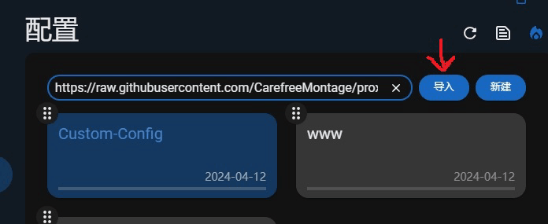
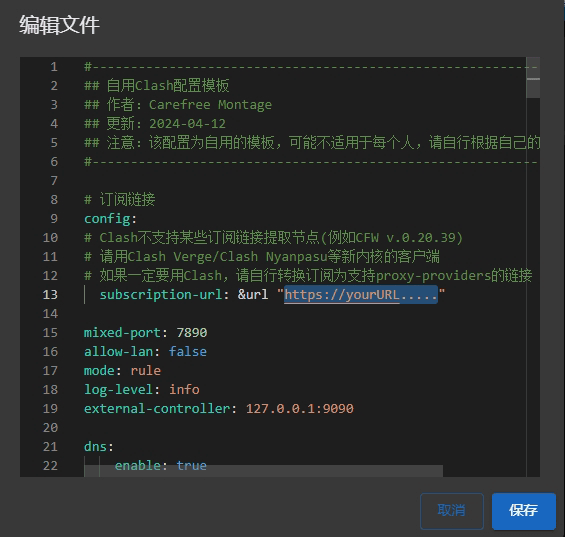

<div align=center></div>

<h1 align=center> Proxy Rules - Custom </h1>

部分代理工具的个人自定义分流规则集以及自用的配置模板<br />

各个代理工具的规则集参考于 [ACL4SSR](https://github.com/ACL4SSR/ACL4SSR/blob/master)/[ios_rule_script](https://github.com/blackmatrix7/ios_rule_script/tree/master/rule) 并根据自己的需求修改，没有什么花里胡哨的需求，只是一些简单的需求，规则与配置提供参考，请根据自己的情况修改。如果你的需求和我大致相同，可以直接参考我的配置文件。

> [!TIP]
> 以下为我的需求:
>
> Google走美国，Netflix默认走新加坡且可选其他节点，Bing走代理且可选直连，OpenAI走代理且可选其他节点，Apple走直连且可选其他节点，Microsoft走直连且可选其他节点，国内网站/ip/流媒体走直连，其余走代理。

## Repo Info
|代理工具| 配置文件 | 规则集 | 备注 |
|:---:|:---:|:---:|:---:|
|Clash Meta  |[ClashConfig.yaml](https://github.com/CarefreeMontage/proxyrules-cm/blob/main/ClashConfig.yaml)|[./Clash/](https://github.com/CarefreeMontage/proxyrules-cm/tree/main/Clash)|✓|
|Quantumult X|[QuantumultX.conf](https://github.com/CarefreeMontage/proxyrules-cm/blob/main/QuantumultX.conf)|[./QuantumultX/](https://github.com/CarefreeMontage/proxyrules-cm/tree/main/QuantumultX)|✓|
|Sing-Box    |待完善|[./Sing-Box/](https://github.com/CarefreeMontage/proxyrules-cm/tree/main/Sing-Box)|规则集可用|
 Shadowrocket|未计划|未计划|不怎么用，有空再搞
- [x] Clash Meta (Verge/Nyanpasu/...)
- [x] Quantumult X
- [ ] Shadowrocket
- [ ] Sing-Box
### Preview
|Clash Meta(Verge/Nyanpasu)| Quantumult X |
|:---:|:---:|
|<div align=center></div>|<div align=center></div>|

## Quick Start

### 1、导入配置文件
#### Clash Meta(Verge/Nyanpasu):
> 配置设置中输入配置文件链接 https://cdn.jsdelivr.net/gh/CarefreeMontage/proxyrules-cm@main/ClashConfig.yaml 点击导入 <details><summary> 展开图片 </summary></details>
#### Quantumult X:
> 找到该页面，点击下载配置,输入 https://cdn.jsdelivr.net/gh/CarefreeMontage/proxyrules-cm@main/QuantumultX.conf 导入配置 <details><summary> 展开图片 </summary></details>

### 2、导入节点
#### Clash Meta(Verge/Nyanpasu):
> 在导入的配置文件中替换你的订阅地址 <details><summary> 展开图片 </summary></details>
#### Quantumult X:
> 在节点资源中输入你的订阅地址进行导入 <details><summary> 展开图片 </summary></details> <details><summary> 展开图片 </summary></details>

### 3、规则集导入
通过远程导入分流规则，远程规则链接请看 [Rules Source](README.md#rules-source)，以下为不同代理工具中的导入方法
> Clash Meta(Verge/Nyanpasu)只能源代码导入
> 
> Quantumult X可以在规则资源中通过GUI交互导入，也可以在配置文件源代码中导入
> 
> Sing-Box目前应该也只能从源代码导入

以下为源代码导入
- **Clash Meta**
```
#仅为参考，请根据自己需求修改

# 规则集
rule-providers:
  # 代理
    google:
      type: http
      behavior: classical
      url: "https://cdn.jsdelivr.net/gh/CarefreeMontage/proxyrules-cm@main/Clash/PROXY/Google.yaml"
      path: ./myConfig/ruleset/proxy/google.yaml
      interval: 86400
    netflix:
      type: http
      behavior: classical
      url: "https://cdn.jsdelivr.net/gh/CarefreeMontage/proxyrules-cm@main/Clash/PROXY/Netflix.yaml"
      path: ./myConfig/ruleset/proxy/netflix.yaml
      interval: 86400
    bing:
      type: http
      behavior: classical
      url: "https://cdn.jsdelivr.net/gh/CarefreeMontage/proxyrules-cm@main/Clash/PROXY/Bing.yaml"
      path: ./myConfig/ruleset/proxy/bing.yaml
      interval: 86400
    openai:
      type: http
      behavior: classical
      url: "https://cdn.jsdelivr.net/gh/CarefreeMontage/proxyrules-cm@main/Clash/PROXY/OpenAI.yaml"
      path: ./myConfig/ruleset/proxy/openai.yaml
      interval: 86400

  # 直连
    china:
      type: http
      behavior: classical
      url: "https://cdn.jsdelivr.net/gh/CarefreeMontage/proxyrules-cm@main/Clash/DIRECT/China.yaml"
      path: ./myConfig/ruleset/direct/china.yaml
      interval: 86400
    apple:
      type: http
      behavior: classical
      url: "https://cdn.jsdelivr.net/gh/CarefreeMontage/proxyrules-cm@main/Clash/DIRECT/Apple.yaml"
      path: ./myConfig/ruleset/direct/apple.yaml
      interval: 86400
    microsoft:
      type: http
      behavior: classical
      url: "https://cdn.jsdelivr.net/gh/CarefreeMontage/proxyrules-cm@main/Clash/DIRECT/Microsoft.yaml"
      path: ./myConfig/ruleset/direct/microsoft.yaml
      interval: 86400

  # 广告拦截
    reject:
      type: http
      behavior: classical
      url: "https://cdn.jsdelivr.net/gh/CarefreeMontage/proxyrules-cm@main/Clash/REJECT/ADBlock.yaml"
      path: ./myConfig/ruleset/reject/rejectAD.yaml
      interval: 86400

  #......之后有需要再加
```

- **Quantumult X**
```
#仅为参考，请根据自己需求修改

# 规则集
[filter_remote]
#广告拦截
https://cdn.jsdelivr.net/gh/CarefreeMontage/proxyrules-cm@main/QuantumultX/REJECT/ADBlock.yaml, tag=❌️ 广告来源, force-policy=广告拦截, update-interval=172800, opt-parser=false, enabled=true
#代理
https://cdn.jsdelivr.net/gh/CarefreeMontage/proxyrules-cm@main/QuantumultX/PROXY/Google.yaml, tag=🛸 谷歌服务, force-policy=Google, update-interval=172800, opt-parser=false, enabled=true
https://cdn.jsdelivr.net/gh/CarefreeMontage/proxyrules-cm@main/QuantumultX/PROXY/Netflix.yaml, tag=📺 奈飞视频, force-policy=Netflix, update-interval=172800, opt-parser=false, enabled=true
https://cdn.jsdelivr.net/gh/CarefreeMontage/proxyrules-cm@main/QuantumultX/PROXY/Bing.yaml, tag=🔍 必应引擎, force-policy=Bing, update-interval=172800, opt-parser=false, enabled=true
https://cdn.jsdelivr.net/gh/CarefreeMontage/proxyrules-cm@main/QuantumultX/PROXY/OpenAI.yaml, tag=🤖 OpenAI, force-policy=OpenAI, update-interval=172800, opt-parser=false, enabled=true
#直连
https://cdn.jsdelivr.net/gh/CarefreeMontage/proxyrules-cm@main/QuantumultX/DIRECT/Apple.yaml, tag=🍎 苹果服务, force-policy=Apple, update-interval=172800, opt-parser=false, enabled=true
https://cdn.jsdelivr.net/gh/CarefreeMontage/proxyrules-cm@main/QuantumultX/DIRECT/Microsoft.yaml, tag=🪟 微软服务, force-policy=Microsoft, update-interval=172800, opt-parser=false, enabled=true
https://cdn.jsdelivr.net/gh/CarefreeMontage/proxyrules-cm@main/QuantumultX/DIRECT/China.yaml, tag=🇨🇳 国内地址, force-policy=国内直连, update-interval=172800, opt-parser=false, enabled=true
```

- **Sing-Box**
```
//仅为参考，请根据自己需求修改

// 规则集
    "rule_set": [
     // 广告拦截
      {
        "tag": "reject",
        "type": "remote",
        "format": "source",
        "path": "./myConfig/ruleset/reject/adblock.json",
        "url": "https://cdn.jsdelivr.net/gh/CarefreeMontage/clashrules-cm@main/Sing-Box/REJECT/ADBlock.json"
      }


      // 代理
      {
        "tag": "google",
        "type": "remote",
        "format": "source",
        "path": "./myConfig/ruleset/proxy/google.json",
        "url": "https://cdn.jsdelivr.net/gh/CarefreeMontage/clashrules-cm@main/Sing-Box/PROXY/Google.json"
      },
      {
        "tag": "netflix",
        "type": "remote",
        "format": "source",
        "path": "./myConfig/ruleset/proxy/netflix.json",
        "url": "https://cdn.jsdelivr.net/gh/CarefreeMontage/clashrules-cm@main/Sing-Box/PROXY/Netflix.json"
      },
      {
        "tag": "bing",
        "type": "remote",
        "format": "source",
        "path": "./myConfig/ruleset/proxy/bing.json",
        "url": "https://cdn.jsdelivr.net/gh/CarefreeMontage/clashrules-cm@main/Sing-Box/PROXY/Bing.json"
      },
      {
        "tag": "openai",
        "type": "remote",
        "format": "source",
        "path": "./myConfig/ruleset/proxy/openai.json",
        "url": "https://cdn.jsdelivr.net/gh/CarefreeMontage/clashrules-cm@main/Sing-Box/PROXY/OpenAI.json"
      },

      // 直连
      {
        "tag": "china",
        "type": "remote",
        "format": "source",
        "path": "./myConfig/ruleset/direct/china.json",
        "url": "https://cdn.jsdelivr.net/gh/CarefreeMontage/clashrules-cm@main/Sing-Box/DIRECT/China.json"
      },
      {
        "tag": "apple",
        "type": "remote",
        "format": "source",
        "path": "./myConfig/ruleset/direct/apple.json",
        "url": "https://cdn.jsdelivr.net/gh/CarefreeMontage/clashrules-cm@main/Sing-Box/DIRECT/Apple.json"
      },
      {
        "tag": "microsoft",
        "type": "remote",
        "format": "source",
        "path": "./myConfig/ruleset/direct/microsoft.json",
        "url": "https://cdn.jsdelivr.net/gh/CarefreeMontage/clashrules-cm@main/Sing-Box/DIRECT/Microsoft.json"
      },

    ],
```
</details>

## Rules Source
<details>
<summary>👆 Clash Meta </summary>

#### :octocat: Github Raw
- **DIRECT - 直连**<br />
国内:https://raw.githubusercontent.com/CarefreeMontage/proxyrules-cm/main/Clash/DIRECT/China.yaml<br />
微软:https://raw.githubusercontent.com/CarefreeMontage/proxyrules-cm/main/Clash/DIRECT/Microsoft.yaml<br />
Apple:https://raw.githubusercontent.com/CarefreeMontage/proxyrules-cm/main/Clash/DIRECT/Apple.yaml

- **PROXY - 代理**<br />
GFW:https://raw.githubusercontent.com/CarefreeMontage/proxyrules-cm/main/Clash/PROXY/GFW.yaml<br />
Google:https://raw.githubusercontent.com/CarefreeMontage/proxyrules-cm/main/Clash/PROXY/Google.yaml<br />
Netflix:https://raw.githubusercontent.com/CarefreeMontage/proxyrules-cm/main/Clash/PROXY/Netflix.yaml<br />
Bing:https://raw.githubusercontent.com/CarefreeMontage/proxyrules-cm/main/Clash/PROXY/Bing.yaml<br />
OpenAI:https://raw.githubusercontent.com/CarefreeMontage/proxyrules-cm/main/Clash/PROXY/OpenAI.yaml

- **REJECT - 屏蔽广告**<br />
广告:https://raw.githubusercontent.com/CarefreeMontage/proxyrules-cm/main/Clash/REJECT/ADBlock.yaml

#### ⚡CDN jsDelivr
- **DIRECT - 直连**<br />
国内直连:https://cdn.jsdelivr.net/gh/CarefreeMontage/proxyrules-cm@main/Clash/DIRECT/China.yaml<br />
微软:https://cdn.jsdelivr.net/gh/CarefreeMontage/proxyrules-cm@main/Clash/DIRECT/Microsoft.yaml<br />
Apple:https://cdn.jsdelivr.net/gh/CarefreeMontage/proxyrules-cm@main/Clash/DIRECT/Apple.yaml

- **PROXY - 代理**<br />
GFW-被墙:https://cdn.jsdelivr.net/gh/CarefreeMontage/proxyrules-cm@main/Clash/PROXY/GFW.yaml<br />
Google:https://cdn.jsdelivr.net/gh/CarefreeMontage/proxyrules-cm@main/Clash/PROXY/Google.yaml<br />
Netflix:https://cdn.jsdelivr.net/gh/CarefreeMontage/proxyrules-cm@main/Clash/PROXY/Netflix.yaml<br />
Bing:https://cdn.jsdelivr.net/gh/CarefreeMontage/proxyrules-cm@main/Clash/PROXY/Bing.yaml<br />
OpenAI:https://cdn.jsdelivr.net/gh/CarefreeMontage/proxyrules-cm@main/Clash/PROXY/OpenAI.yaml

- **REJECT - 屏蔽广告**<br />
广告:https://cdn.jsdelivr.net/gh/CarefreeMontage/proxyrules-cm@main/Clash/REJECT/ADBlock.yaml

</details>

<details>
<summary>👆 Quantumult X </summary>

#### :octocat: Github Raw
- **DIRECT - 直连**<br />
国内:https://raw.githubusercontent.com/CarefreeMontage/proxyrules-cm/main/QuantumultX/DIRECT/China.yaml<br />
微软:https://raw.githubusercontent.com/CarefreeMontage/proxyrules-cm/main/QuantumultX/DIRECT/Microsoft.yaml<br />
Apple:https://raw.githubusercontent.com/CarefreeMontage/proxyrules-cm/main/QuantumultX/DIRECT/Apple.yaml

- **PROXY - 代理**<br />
Google:https://raw.githubusercontent.com/CarefreeMontage/proxyrules-cm/main/QuantumultX/PROXY/Google.yaml<br />
Netflix:https://raw.githubusercontent.com/CarefreeMontage/proxyrules-cm/main/QuantumultX/PROXY/Netflix.yaml<br />
Bing:https://raw.githubusercontent.com/CarefreeMontage/proxyrules-cm/main/QuantumultX/PROXY/Bing.yaml<br />
OpenAI:https://raw.githubusercontent.com/CarefreeMontage/proxyrules-cm/main/QuantumultX/PROXY/OpenAI.yaml

- **REJECT - 屏蔽广告**<br />
广告:https://raw.githubusercontent.com/CarefreeMontage/proxyrules-cm/main/QuantumultX/REJECT/ADBlock.yaml

#### ⚡CDN jsDelivr
- **DIRECT - 直连**<br />
国内直连:https://cdn.jsdelivr.net/gh/CarefreeMontage/proxyrules-cm@main/QuantumultX/DIRECT/China.yaml<br />
微软:https://cdn.jsdelivr.net/gh/CarefreeMontage/proxyrules-cm@main/QuantumultX/DIRECT/Microsoft.yaml<br />
Apple:https://cdn.jsdelivr.net/gh/CarefreeMontage/proxyrules-cm@main/QuantumultX/DIRECT/Apple.yaml

- **PROXY - 代理**<br />
Google:https://cdn.jsdelivr.net/gh/CarefreeMontage/proxyrules-cm@main/QuantumultX/PROXY/Google.yaml<br />
Netflix:https://cdn.jsdelivr.net/gh/CarefreeMontage/proxyrules-cm@main/QuantumultX/PROXY/Netflix.yaml<br />
Bing:https://cdn.jsdelivr.net/gh/CarefreeMontage/proxyrules-cm@main/QuantumultX/PROXY/Bing.yaml<br />
OpenAI:https://cdn.jsdelivr.net/gh/CarefreeMontage/proxyrules-cm@main/QuantumultX/PROXY/OpenAI.yaml

- **REJECT - 屏蔽广告**<br />
广告:https://cdn.jsdelivr.net/gh/CarefreeMontage/proxyrules-cm@main/QuantumultX/REJECT/ADBlock.yaml

</details>

<details>
<summary>👆 Sing-Box </summary>

#### :octocat: Github Raw
- **DIRECT - 直连**<br />
国内:https://raw.githubusercontent.com/CarefreeMontage/proxyrules-cm/main/Sing-Box/DIRECT/China.json<br />
微软:https://raw.githubusercontent.com/CarefreeMontage/proxyrules-cm/main/Sing-Box/DIRECT/Microsoft.json<br />
Apple:https://raw.githubusercontent.com/CarefreeMontage/proxyrules-cm/main/Sing-Box/DIRECT/Apple.json

- **PROXY - 代理**<br />
GFW:https://raw.githubusercontent.com/CarefreeMontage/proxyrules-cm/main/Sing-Box/PROXY/GFW.json<br />
Google:https://raw.githubusercontent.com/CarefreeMontage/proxyrules-cm/main/Sing-Box/PROXY/Google.json<br />
Netflix:https://raw.githubusercontent.com/CarefreeMontage/proxyrules-cm/main/Sing-Box/PROXY/Netflix.json<br />
Bing:https://raw.githubusercontent.com/CarefreeMontage/proxyrules-cm/main/Sing-Box/PROXY/Bing.json<br />
OpenAI:https://raw.githubusercontent.com/CarefreeMontage/proxyrules-cm/main/Sing-Box/PROXY/OpenAI.json

- **REJECT - 屏蔽广告**<br />
广告:https://raw.githubusercontent.com/CarefreeMontage/proxyrules-cm/main/Sing-Box/REJECT/ADBlock.json

#### ⚡CDN jsDelivr
- **DIRECT - 直连**<br />
国内直连:https://cdn.jsdelivr.net/gh/CarefreeMontage/proxyrules-cm@main/Sing-Box/DIRECT/China.json<br />
微软:https://cdn.jsdelivr.net/gh/CarefreeMontage/proxyrules-cm@main/Sing-Box/DIRECT/Microsoft.json<br />
Apple:https://cdn.jsdelivr.net/gh/CarefreeMontage/proxyrules-cm@main/Sing-Box/DIRECT/Apple.json

- **PROXY - 代理**<br />
GFW-被墙:https://cdn.jsdelivr.net/gh/CarefreeMontage/proxyrules-cm@main/Sing-Box/PROXY/GFW.json<br />
Google:https://cdn.jsdelivr.net/gh/CarefreeMontage/proxyrules-cm@main/Sing-Box/PROXY/Google.json<br />
Netflix:https://cdn.jsdelivr.net/gh/CarefreeMontage/proxyrules-cm@main/Sing-Box/PROXY/Netflix.json<br />
Bing:https://cdn.jsdelivr.net/gh/CarefreeMontage/proxyrules-cm@main/Sing-Box/PROXY/Bing.json<br />
OpenAI:https://cdn.jsdelivr.net/gh/CarefreeMontage/proxyrules-cm@main/Sing-Box/PROXY/OpenAI.json

- **REJECT - 屏蔽广告**<br />
广告:https://cdn.jsdelivr.net/gh/CarefreeMontage/proxyrules-cm@main/Sing-Box/REJECT/ADBlock.json

</details>

## Notice
> [!WARNING]
>
> **叠甲**:
>
> 分流规则是实现不同的网站走不同的节点或策略组的规则文本，其数据均收集自互联网公开信息。
>
> 本仓库中涉及的软件与本项目没有任何直接或间接的关系。本项目仅对代理分流规则进行描述于搬运，不代表支持去使用任何软件。使用任何第三方硬件、软件，所造成的一切后果由使用的个人或组织承担，与本项目无关。
>
> 本仓库中所有内容只供学习和研究使用，基于该仓库源代码进行的任何修改，为其他个人或组织的自发行为，与本项目没有任何直接或间接的关系，所造成的一切后果亦与本项目无关。

## Credit

— [ACL4SSR](https://github.com/ACL4SSR/ACL4SSR/blob/master)

— [ios_rule_script](https://github.com/blackmatrix7/ios_rule_script/tree/master/rule)
